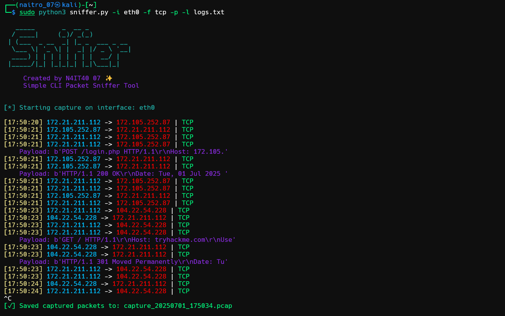

# 🕵️ **CodeAlpha_PacketSniffer**

A lightweight Python-based **CLI Packet Sniffer** that captures and analyzes network traffic in real-time using Scapy.

---

## 📌 About the Project

This tool is built as part of the **CodeAlpha Internship**. It provides a command-line interface to:

- Capture live network traffic using `scapy`
- Print source & destination IPs, protocol, and optional payload
- Save logs to a file
- Automatically generate `.pcap` capture files
- Display a stylish banner and interactive output

---

## 🎯 Features

✅ Interface selection & validation  
✅ Protocol filter (TCP, UDP, custom)  
✅ Payload dump (first 40 bytes)  
✅ Logging support  
✅ `.pcap` output generation  
✅ Graceful shutdown with Ctrl+C  
✅ Written in pure Python

---

## 🧪 Usage

```bash
sudo python3 sniffer.py -i <interface> [options]
````

### ✅ Required Argument

- `-i`, `--interface`: Network interface to sniff (e.g., `eth0`, `wlan0`, `lo`)

### ✅ Optional Flags

| Flag              | Description                                 |
| ----------------- | ------------------------------------------- |
| `-f`, `--filter`  | BPF filter (e.g., `tcp`, `udp`, `port 80`)  |
| `-p`, `--payload` | Print first 40 bytes of each packet payload |
| `-l`, `--log`     | Path to log file for saving traffic data    |

---

## 📸 Screenshot



---

## 🎥 Demo Video


https://github.com/user-attachments/assets/c1e8c220-ae16-486c-9959-0894904b5297


---

## 💾 Sample Output

```bash

[17:30:35] 192.168.0.101 -> 172.105.252.87 | TCP
    Payload: b'POST /login.php HTTP/1.1\r\nHost: 172.105.'
```

And logs are saved in `logs.txt` like:

```bash
192.168.0.101 -> 172.105.252.87 | Protocol: TCP
```

---

## 📁 Sample `.pcap`

A sample `.pcap` file is saved after capture ends (on Ctrl+C).
File will be named like `capture_20250701_1745.pcap`.

> 🧪 You can open it in Wireshark.

---

## 🛠️ Dependencies

- `scapy`

- `colorama`

Install via:

```bash
pip install -r requirements.txt
```

---
